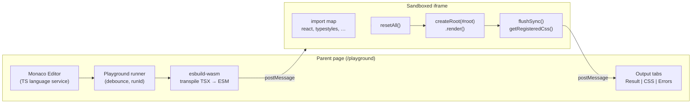

# Interactive playground (REPL)

## Problem

Typestyles is best understood by trying it: defining tokens, building components
with variants, and seeing the emitted CSS alongside the rendered output. The docs
site already ships read-only `LiveDemo` islands (authored code + variant toggles +
CSS panel), but there is no way for visitors to edit code and explore the API
themselves.

Without an interactive playground, evaluators must clone an example app or set up
a local project before they can answer basic questions: Does the API feel right?
Do variants work the way I expect? What CSS does this produce?

## Goals

- **Route:** `/playground` — top-level, full-viewport page (like
  [Svelte Playground](https://svelte.dev/playground)), not nested under `/docs`.
- **Single editable file:** `App.tsx` — a React component that is both the source
  and the live preview.
- **Editor:** Monaco with TypeScript/TSX syntax highlighting, semantic type
  checking, hover docs, and autocomplete for `typestyles` and `@typestyles/react`
  APIs (via Monaco's TypeScript language service worker — the same approach used
  by Svelte Playground and the TypeScript playground; no remote LSP server).
- **Auto-run:** Debounced re-run on edit (~300 ms) plus Cmd/Ctrl+Enter for
  immediate run.
- **Output panes:**
  - **Result** — React tree rendered in a sandboxed iframe.
  - **CSS** — `getRegisteredCss()` after each successful run, pretty-printed.
  - **Errors** — compile-time (Monaco markers) and runtime (React error boundary +
    console) surfaced together.
- **Preset picker:** Dropdown in the header to load starter templates (styled
  API, `css` prop, theming).
- **React v1:** Preview uses `@typestyles/react` (`createStyled`,
  `TypeStylesProvider`, optional `css` prop via `jsxImportSource`).
- **Isolation:** Playground styles must not leak into the docs site chrome or
  global `typestyles.css` extraction.

## Non-goals (v1)

- URL-encoded shareable state (`?code=…`) — follow-up.
- Multi-file editor (separate `styles.ts` + `App.tsx` tabs) — follow-up.
- Preset sidebar tree (Svelte-style left nav) — follow-up; v1 uses header
  dropdown only.
- Production CSS tab via `runTypestylesBuild` / Netlify function — follow-up.
- Zero-runtime Babel transform for static `css` props — playground runs in
  runtime mode only.
- Console `log` capture beyond basic error display — nice-to-have, not blocking.
- Offline support.

## Reference UX

Modeled on Svelte Playground:

```
┌──────────────────────────────────────────────────────────────────────┐
│  [logo]  Playground   [Preset ▾]              [Docs]                 │
├────────────────────────────┬─────────────────────────────────────────┤
│  [App.tsx]                 │  Result │ CSS │ Errors                    │
│                            │                                         │
│  Monaco editor             │  React preview (live)                   │
│  (TypeScript + JSX)        │                                         │
│                            │                                         │
├────────────────────────────┴─────────────────────────────────────────┤
│  CONSOLE (collapsible)                                               │
└──────────────────────────────────────────────────────────────────────┘
```

- Dedicated `PlaygroundLayout` — no docs sidebar; maximize editor space.
- Header: logo, page title, **preset dropdown**, link back to docs.
- Resizable split between editor (left) and output (right).
- On narrow viewports: stack editor above output.

## User file convention

The playground edits one file, `App.tsx`. The **default export** is mounted as
the app root inside the preview iframe.

```tsx
import { useState } from 'react';
import { createTypeStyles } from 'typestyles';
import { createStyled, TypeStylesProvider } from '@typestyles/react';

const { styles, tokens } = createTypeStyles({ scopeId: 'playground' });

const color = tokens.create('color', {
  primary: '#0066ff',
  surface: '#ffffff',
});

const styled = createStyled(styles);

const Button = styled('button', {
  base: {
    padding: '8px 16px',
    borderRadius: '6px',
    border: 'none',
    cursor: 'pointer',
    fontWeight: 500,
  },
  variants: {
    intent: {
      primary: { backgroundColor: color.primary, color: color.surface },
      ghost: {
        backgroundColor: 'transparent',
        color: color.primary,
        border: `1px solid ${color.primary}`,
      },
    },
  },
  defaultVariants: { intent: 'primary' },
});

export default function App() {
  const [intent, setIntent] = useState<'primary' | 'ghost'>('primary');

  return (
    <TypeStylesProvider styles={styles}>
      <div style={{ padding: '2rem', display: 'flex', gap: '1rem' }}>
        <Button
          intent={intent}
          onClick={() => setIntent((i) => (i === 'primary' ? 'ghost' : 'primary'))}
        >
          Toggle intent
        </Button>
      </div>
    </TypeStylesProvider>
  );
}
```

**Rules:**

- Always use `createTypeStyles({ scopeId: 'playground' })` in templates and
  docs copy so playground CSS is namespaced.
- Wrap the tree in `TypeStylesProvider` when using `createStyled` or the `css`
  prop.
- Hooks and JSX use the automatic JSX runtime (`react-jsx`); import hooks from
  `'react'` explicitly.

## Architecture

### Overview



Three isolated concerns:

1. **Editor** — Monaco + TypeScript worker for diagnostics and IntelliSense.
2. **Runner** — transpile user source, coordinate runs, handle stale responses.
3. **Preview iframe** — sandboxed execution, React mount, CSS collection.

### Parent page (`/playground`)

| Piece                    | Responsibility                                           |
| ------------------------ | -------------------------------------------------------- |
| `playground.astro`       | Route shell; lazy-loads client bundle                    |
| `PlaygroundLayout.astro` | Full-viewport chrome (header, no docs sidebar)           |
| `playgroundClient.ts`    | Monaco init, debounced run loop, tab switching           |
| `monacoSetup.ts`         | Worker URL, compiler options, bundled `.d.ts` extra libs |
| `esbuild-wasm`           | Transpile `App.tsx` → ESM on each run                    |

Monaco and esbuild-wasm are **lazy-loaded** on this route only so other docs
pages are unaffected.

### Sandboxed iframe

Pre-loaded once per session with a fixed dependency graph:

| Module                      | Source                                          |
| --------------------------- | ----------------------------------------------- |
| `react`, `react-dom/client` | esm.sh (pinned version, e.g. 18.3.x)            |
| `typestyles`                | Static vendor bundle from workspace `dist/`     |
| `@typestyles/react`         | Static vendor bundle from workspace `dist/`     |
| User `App.tsx`              | Transpiled blob URL, dynamic `import()` per run |

**Import map** in the iframe document resolves bare specifiers so user code keeps
normal `import` syntax:

```html
<script type="importmap">
  {
    "imports": {
      "react": "https://esm.sh/react@18.3.1",
      "react-dom/client": "https://esm.sh/react-dom@18.3.1/client",
      "typestyles": "/playground/vendor/typestyles.js",
      "@typestyles/react": "/playground/vendor/typestyles-react.js"
    }
  }
</script>
```

Vendor bundles are copied or emitted at docs build time from workspace packages
so runtime and type definitions stay version-locked.

**Iframe bootstrap** (`iframeRunner.ts`):

1. Listen for `postMessage({ type: 'playground-run', runId, code })`.
2. `resetAll()` from `typestyles/testing`.
3. `root.unmount()` if a previous React root exists.
4. Revoke prior blob URL(s).
5. `const blob = new Blob([code], { type: 'text/javascript' })`.
6. `const mod = await import(URL.createObjectURL(blob))`.
7. `createRoot(document.getElementById('root')).render(createElement(mod.default))`.
8. `flushSync()` then `getRegisteredCss()`.
9. `postMessage({ type: 'playground-result', runId, css, error: null })` to parent.

On failure: catch transpile/import/render errors; post structured error back;
parent shows in Errors tab and optionally as Monaco markers where applicable.

**Security:**

- Preview iframe uses `sandbox="allow-scripts allow-same-origin"`.
  `allow-scripts` alone gives the frame an opaque `null` origin, which blocks
  loading local ESM modules (`iframe-runner.js`, vendor bundles) via CORS.
  `allow-same-origin` is required so those assets can load from the docs host.
- User code still runs only inside the iframe; the parent communicates via
  `postMessage` and never `eval`s on the docs page.
- Do not store secrets in the playground parent page.

### Run loop

```ts
const DEBOUNCE_MS = 300;
let runId = 0;

async function run(source: string) {
  const id = ++runId;

  const result = await esbuild.transform(source, {
    loader: 'tsx',
    jsx: 'automatic',
    jsxImportSource: '@typestyles/react',
    target: 'es2022',
    format: 'esm',
  });

  if (id !== runId) return; // stale — user typed again

  iframe.contentWindow!.postMessage({ type: 'playground-run', runId: id, code: result.code }, '*');
}
```

- First load: run immediately with default template (no debounce).
- `editor.onDidChangeModelContent` → debounced `run`.
- Cmd/Ctrl+Enter → immediate `run`.
- Ignore iframe responses where `runId !== currentRunId`.

### Monaco / TypeScript configuration

```ts
monaco.languages.typescript.typescriptDefaults.setCompilerOptions({
  target: ts.ScriptTarget.ES2022,
  module: ts.ModuleKind.ESNext,
  moduleResolution: ts.ModuleResolutionKind.Bundler,
  jsx: ts.JsxEmit.ReactJSX,
  jsxImportSource: '@typestyles/react',
  strict: true,
  noEmit: true,
  esModuleInterop: true,
});
```

**Extra libs** (bundled at docs build time into a fetchable asset):

- `typestyles` (+ subpaths used by presets, e.g. `typestyles/color` if needed)
- `@typestyles/react`
- `@types/react`, `@types/react-dom`
- `csstype` (style object property names in `css` prop / style literals)

Build step: `docs/src/playground/bundleTypes.ts` (or similar) concatenates
`.d.ts` files from workspace packages into `public/playground/types.txt` (or
per-package files) loaded by `monacoSetup.ts` on init.

## Preset picker (header dropdown)

A `<select>` (or accessible custom dropdown) in the playground header. Changing
selection replaces editor content with the template source and triggers an
immediate run.

| Preset ID      | Label        | Teaches                                               |
| -------------- | ------------ | ----------------------------------------------------- |
| `hello-button` | Hello button | `createTypeStyles`, tokens, `createStyled`, variants  |
| `css-prop`     | CSS prop     | `jsxImportSource: '@typestyles/react'`, `css={{ … }}` |
| `theming`      | Light / dark | `colorModes`, theme toggle with `useState`            |

Templates live as static files:

```
docs/src/playground/templates/
  hello-button.tsx
  css-prop.tsx
  theming.tsx
```

Selecting a preset while the editor is dirty should confirm before overwrite
(simple `confirm()` or inline dialog).

## Output panes

### Result

- Sandboxed iframe with `#root` mount point.
- Full re-mount on each successful run (no Fast Refresh in v1).
- Minimal iframe document styles (system font, no margin on `body`) so user
  styles are visible without docs chrome bleeding in.

### CSS

- Content from `getRegisteredCss()` after React render + `flushSync()`.
- Pretty-print via existing `formatDemoCss()` (`docs/src/lib/formatDemoCss.ts`).
- Syntax highlight via `highlightLiveCode.ts` / `highlightDocCode.ts` patterns.

### Errors

- **Compile:** esbuild transform errors → Errors tab + message list.
- **Type:** Monaco diagnostics in editor (squiggles); summary in Errors tab optional.
- **Runtime:** React error boundary in iframe + uncaught promise rejections →
  Errors tab and console strip.

### Console

- Collapsible strip at bottom of output column.
- Shows runtime errors and `console.error` forwarded from iframe via `postMessage`.
- `console.log` forwarding is optional for v1.

## Isolation from docs site

| Rule                                                                     | Rationale                                               |
| ------------------------------------------------------------------------ | ------------------------------------------------------- |
| `scopeId: 'playground'` in all templates                                 | Avoid class/token namespace collisions                  |
| Do **not** import playground modules from `docs/src/typestyles-entry.ts` | Playground CSS must not ship in global `typestyles.css` |
| `resetAll()` before every run                                            | No style accumulation between runs                      |
| Playground layout styles in `docs/src/styles/playground.ts`              | Separate from `liveDemo` and docs chrome                |

## File layout

```
docs/
├── public/
│   └── playground/
│       └── vendor/
│           ├── typestyles.js          # built from workspace package
│           └── typestyles-react.js
├── src/
│   ├── layouts/
│   │   └── PlaygroundLayout.astro
│   ├── pages/
│   │   └── playground.astro           # → /playground
│   ├── components/
│   │   └── Playground/
│   │       ├── Playground.astro
│   │       ├── playgroundClient.ts
│   │       ├── monacoSetup.ts
│   │       └── outputPanels.ts
│   ├── playground/
│   │   ├── iframe.html
│   │   ├── iframeRunner.ts
│   │   ├── bundleTypes.ts             # build: pack .d.ts for Monaco
│   │   └── templates/          # (moved — see playground-templates/)
│   └── styles/
│       └── playground.ts
└── playground-templates/       # Raw App.tsx sources (outside Vite src/)
    ├── hello-button.tsx
    ├── css-prop.tsx
    └── theming.tsx
```

**Navigation:** Add `{ href: '/playground', title: 'Playground' }` to site header
or `docs/src/navigation.ts` (Getting Started category). Link from
`getting-started.md` once shipped.

## Dependencies (docs package)

| Package         | Purpose                              |
| --------------- | ------------------------------------ |
| `monaco-editor` | Editor + TypeScript language service |
| `esbuild-wasm`  | In-browser TSX → ESM transpilation   |

Existing docs deps reused: `highlight.js` (output panels), `formatDemoCss`,
design-system tokens for playground chrome styling.

## Implementation phases

### Phase 1 — React skeleton

- `PlaygroundLayout.astro` + `/playground` route
- Split-pane UI (editor left, output right)
- Monaco with TSX syntax highlighting (types not yet)
- Sandboxed iframe: React 18 + vendor bundles + import map
- Hardcoded default `App.tsx` → transpile → mount → Result tab
- CSS tab shows raw `getRegisteredCss()` output

### Phase 2 — Auto-run + type checking

- [x] Debounced auto-run (300 ms) + Cmd/Ctrl+Enter
- [x] `bundleTypes` build step + Monaco extra libs (`public/playground/types.json`)
- [x] Editor diagnostics and autocomplete for core APIs
- [x] React error boundary → Errors tab
- [x] `resetAll()` + `root.unmount()` between runs
- [x] `runId` stale-run guard

### Phase 3 — Polish

- [x] Header preset dropdown (3 templates) with dirty confirm
- [x] CSS tab uses `formatDemoCss` + syntax highlighting
- [x] Collapsible console strip
- [x] Loading state during editor/transpile init
- [x] Link from getting-started → `/playground`
- [x] Responsive stacked layout on small screens
- [x] Lazy-load Monaco + esbuild-wasm (route-level code splitting)
- [x] URL state: `?code=` (lz-string) / `?preset=` + Share button

### Phase 4 — Follow-ups (still open)

- Production CSS tab: Netlify function wrapping `runTypestylesBuild` /
  `collectDemoCss`
- Multi-file tabs (`styles.ts` + `App.tsx`)
- Preset sidebar tree
- `console.log` mirroring

## Risks and mitigations

| Risk                         | Mitigation                                                              |
| ---------------------------- | ----------------------------------------------------------------------- |
| Monaco bundle size (~2–4 MB) | Route-level code splitting; load only on `/playground`                  |
| esm.sh availability / drift  | Pin exact versions; vendor `typestyles` locally; monitor esm.sh         |
| Stale async runs             | Monotonic `runId`; drop mismatched iframe responses                     |
| Style leakage                | `resetAll()` + unmount; never add playground to `typestyles-entry.ts`   |
| View Transitions re-init     | Bind playground init on `astro:page-load` (same as `liveDemoClient.ts`) |
| User infinite loop           | Optional 5 s execution timeout in iframe (post back timeout error)      |
| Preset overwrite data loss   | Confirm dialog when editor is dirty                                     |

## Testing

| Area               | Approach                                                                    |
| ------------------ | --------------------------------------------------------------------------- |
| `formatDemoCss`    | Already tested; reuse as-is                                                 |
| `bundleTypes`      | Unit test: output includes key exports (`createTypeStyles`, `createStyled`) |
| Run loop / `runId` | Unit test stale-run discard logic                                           |
| iframe runner      | Integration test with Vitest + happy-dom or manual QA checklist             |
| E2E (optional)     | Playwright: load `/playground`, edit source, assert preview + CSS update    |

Manual QA checklist before ship:

1. Default template renders button; CSS tab shows rules.
2. Typo in TS → Monaco squiggle + Errors tab.
3. Runtime throw in `App` → error boundary message in Errors tab.
4. Preset switch replaces code and re-runs.
5. Rapid typing does not show stale CSS from prior run.
6. Docs pages unaffected (no playground classes in global CSS).
7. Mobile: editor and output stack; usable scroll.

## Relationship to existing work

- **LiveDemo** (`docs/src/components/LiveDemo.astro`): read-only, SSR-extracted
  CSS, variant chips. Playground reuses CSS formatting and highlighting patterns
  but replaces authored demos with user-editable React source.
- **IMPROVEMENTS.md P1.6 / P6:** LiveDemo shipped; editable REPL was listed as
  future — this spec implements it.
- **`@typestyles/react`:** Primary integration surface for v1 previews; aligns
  with P3.25 shipped package.

## Open questions (resolved)

| Question      | Decision                                                 |
| ------------- | -------------------------------------------------------- |
| Route         | `/playground`                                            |
| Run trigger   | Debounced auto-run + Cmd/Ctrl+Enter                      |
| Preview model | React `App.tsx` default export                           |
| Preset UI     | Header dropdown (not sidebar tree)                       |
| LSP           | Monaco TypeScript worker (in-browser), not remote server |
